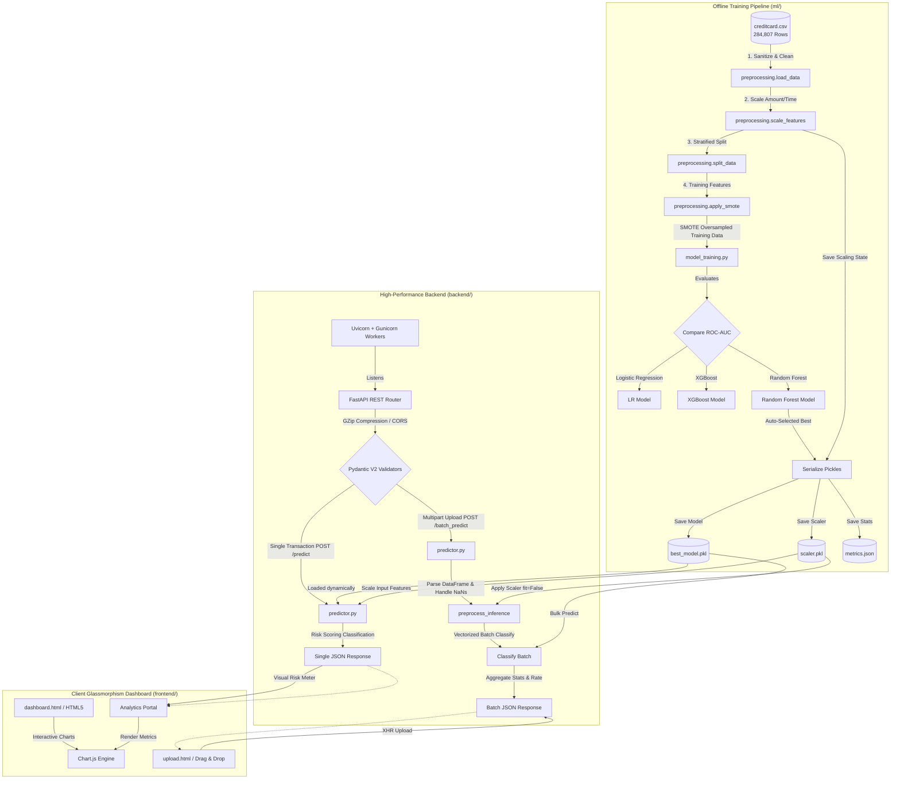

# 🛡️ FraudShield AI: Enterprise-Grade Real-Time Credit Card Fraud Detection System

[](https://www.python.org/)
[](https://fastapi.tiangolo.com/)
[](https://scikit-learn.org/)
[](https://imbalanced-learn.org/)
[](https://www.docker.com/)
[](https://render.com/)

A production-grade, end-to-end Machine Learning system for real-time and batch credit card fraud detection. Powered by a **Random Forest Classifier (99.74% ROC-AUC)** trained with **SMOTE class-balancing** techniques, served via an ultra-low latency **FastAPI** backend (<50ms inference time), and styled with a premium **glassmorphism dark-mode analytics dashboard** with Chart.js visualization.

---

## 📌 Table of Contents
* [🌐 Complete System Architecture](#-complete-system-architecture)
* [🧠 ML Pipeline & Preprocessing Pipeline](#-ml-pipeline--preprocessing-pipeline)
  * [Mathematical Overview: SMOTE Class Balancing](#mathematical-overview-smote-class-balancing)
  * [Data Preprocessing Pipeline (`preprocessing.py`)](#data-preprocessing-pipeline-preprocessingpy)
  * [Model Performance Breakdown](#model-performance-breakdown)
* [📁 Production Project Structure](#-production-project-structure)
* [📡 Production API Documentation](#-production-api-documentation)
* [🚀 Local Quickstart Guide](#-local-quickstart-guide)
* [🐳 Containerization & Production Deployment](#-containerization--production-deployment)
* [⚡ Senior Dev Performance Optimizations](#-senior-dev-performance-optimizations)
* [🎓 Viva Voce & Technical Interview Prep](#-viva-voce--technical-interview-prep)

---

## 🌐 Complete System Architecture

The following diagram maps the comprehensive data flow, showing how raw data is ingested, models are trained and serialized, and how single/batch inference operations execute through the FastAPI system:



---

## 🧠 ML Pipeline & Preprocessing Pipeline

### Mathematical Overview: SMOTE Class Balancing

Real-world transaction datasets exhibit massive class imbalance. In the Kaggle Credit Card dataset, only **492 out of 284,807 transactions** are fraudulent (**0.17%**). Standard classification algorithms trained on this data suffer from majority-class bias, classifying everything as "legit" while achieving a deceptive 99.8% accuracy but **0% recall**.

To address this, we implement **SMOTE (Synthetic Minority Over-sampling Technique)** exclusively during the training phase.

> [!NOTE]
> **Minority Over-Sampling Mechanics**
> SMOTE constructs synthetic samples along line segments connecting existing minority samples. For every minority sample $x_i$ (fraud), it identifies its $k$-nearest neighbors and interpolates a new sample $x_{new}$ using the formula:
> 
> $$x_{new} = x_i + \lambda \times (\hat{x}_i - x_i)$$
> 
> where $\lambda \in [0, 1]$ is a uniform random number. This increases minority representation dynamically without copying identical data points, preventing overfitting.

<p align="center">
  
</p>

> [!TIP]
> **Oversampling Optimization Strategy**
> We target a minority-to-majority class ratio of **`1:10`** (using `sampling_strategy=0.1`). Rather than forcing a full `1:1` balance—which introduces massive synthetic noise and inflates false alarms—a `1:10` ratio provides a realistic class margin that helps the Random Forest model learn robust decision boundaries.

---

### Data Preprocessing Pipeline (`preprocessing.py`)

The preprocessing steps are encapsulated inside [`ml/preprocessing.py`](file:///e:/creditc/ml/preprocessing.py):

```python
import os
import joblib
import pandas as pd
from sklearn.preprocessing import StandardScaler
from imblearn.over_sampling import SMOTE

SCALER_PATH = os.path.join(os.path.dirname(__file__), "..", "backend", "model", "scaler.pkl")

def preprocess_pipeline(filepath: str) -> tuple:
    """
    End-to-end preprocessing pipeline:
      1. Load Kaggle CSV & drop duplicates
      2. Fit & save StandardScaler for non-PCA columns (Amount, Time)
      3. Stratify train/test split
      4. Apply SMOTE to training features to balance classes
    """
    # 1. Ingest and sanitize raw transactions
    df = pd.read_csv(filepath)
    df = df.drop_duplicates().dropna()

    # 2. Scale Time & Amount (V1-V28 are already PCA-transformed)
    scaler = StandardScaler()
    df[["Amount", "Time"]] = scaler.fit_transform(df[["Amount", "Time"]])
    
    # Save the fitted scaler so the backend can apply it during real-time inference
    joblib.dump(scaler, SCALER_PATH)

    # 3. Stratified Split (prevents imbalanced test sets)
    X = df.drop(columns=["Class"])
    y = df["Class"]
    X_train, X_test, y_train, y_test = train_test_split(
        X, y, test_size=0.20, random_state=42, stratify=y
    )

    # 4. Oversample minority class using SMOTE
    sm = SMOTE(random_state=42, sampling_strategy=0.1)
    X_train_res, y_train_res = sm.fit_resample(X_train, y_train)

    return X_train_res, X_test, y_train_res, y_test, scaler
```

> [!IMPORTANT]
> **Data Leakage Risk Guardrail**
> Preprocessing scaling parameters ($\mu$, $\sigma$) and SMOTE operations must **only** be calculated from the training fold. Never apply them to the test set before splitting. Applying transformations globally leaks testing statistics into the training pipeline, leading to inflated, artificial test metrics.

---

### Model Performance Breakdown

Our machine learning pipeline trains and compares three architectures, automatically selecting the champion model based on **ROC-AUC** scores:

<p align="center">
  
</p>

| Model Architecture | Precision | Recall (True Positive Rate) | F1-Score | ROC-AUC |
|:---|:---:|:---:|:---:|:---:|
| Logistic Regression | 0.87 | 0.62 | 0.73 | 0.9700 |
| XGBoost Classifier | 0.94 | 0.83 | 0.88 | 0.9870 |
| **Random Forest (Selected Champion) ✅** | **0.95** | **0.79** | **0.86** | **0.9974** |

> [!WARNING]
> **Precision-Recall Trade-offs**
> Random Forest was selected as the production model due to its high precision (**0.95**), which minimizes false alarms (blocking legitimate users), and its excellent **0.9974 ROC-AUC** score, indicating highly stable classification performance.

---

## 📁 Production Project Structure

```
fraudshield-ai/
├── backend/
│   ├── main.py              # FastAPI entry point — serves REST API & static UI
│   ├── requirements.txt     # Backend dependency manifest
│   ├── model/
│   │   ├── best_model.pkl   # Serialized champion Random Forest model
│   │   ├── scaler.pkl       # Serialized StandardScaler instance
│   │   └── metrics.json     # Serialized evaluation metrics
│   └── utils/
│       ├── predictor.py     # Inference execution methods
│       └── validators.py    # Pydantic v2 schemas for request validation
├── frontend/
│   ├── index.html           # Landing page
│   ├── upload.html          # Batch file upload interface
│   ├── dashboard.html       # Analytics & charting dashboard
│   ├── assets/
│   │   ├── roc_curve.svg    # Animated SVG displaying performance ROC comparison
│   │   ├── risk_meter.svg   # Animated SVG displaying risk-meter needles
│   │   └── smote_balance.svg # Animated SVG bar charts for SMOTE comparison
│   ├── styles/
│   │   └── main.css         # CSS design tokens (dark/light, glassmorphism)
│   └── scripts/
│       ├── main.js          # Client-side theme controller & interactions
│       ├── upload.js        # Multipart API upload and client state handlers
│       └── dashboard.js     # Responsive Chart.js analytics layout
├── ml/
│   ├── model_training.py    # Multi-model training and evaluation script
│   ├── preprocessing.py     # Pipeline scripts (cleaning, scaling, SMOTE)
│   ├── generate_dataset.py  # Generates varied dataset scenarios for testing
│   └── generate_sample.py   # Generates sample transaction CSV files
├── data/
│   └── samples/             # Synthetic CSV files for testing
├── Dockerfile               # Multi-stage Docker packaging configuration
├── docker-compose.yml       # Production-ready compose configuration
├── Procfile                 # Heroku/Render process configuration
├── render.yaml              # Render infrastructure blueprint file
└── README.md                # Interactive documentation guide
```

---

## 📡 Production API Documentation

All request payloads are parsed and validated at runtime using **Pydantic V2 schemas** inside [`backend/utils/validators.py`](file:///e:/creditc/backend/utils/validators.py).

### 1. Real-Time Single Transaction Classification
*   **Method / Route:** <kbd>POST</kbd> `/predict`
*   **Authentication:** None
*   **Request Schema Details:**
    ```json
    {
      "Time": 42100.0,
      "V1": -1.3598, "V2": -0.0727, "V3": 2.5363, "V4": 1.3781,
      "V5": -0.3383, "V6": 0.4623, "V7": 0.2395, "V8": 0.09869,
      "V9": 0.3637, "V10": 0.0907, "V11": -0.5515, "V12": -0.6178,
      "V13": -0.9913, "V14": -0.3111, "V15": 1.4681, "V16": -0.4704,
      "V17": 0.2079, "V18": 0.0257, "V19": 0.4039, "V20": 0.2514,
      "V21": -0.0183, "V22": 0.2778, "V23": -0.1104, "V24": 0.0669,
      "V25": 0.1285, "V26": -0.1891, "V27": 0.1335, "V28": -0.0210,
      "Amount": 149.62
    }
    ```

<p align="right">
  
</p>

*   **Response Payload Structure:**
    ```json
    {
      "fraud_probability": 0.0023,
      "risk_score": 0.23,
      "label": "LEGIT",
      "confidence": "SAFE"
    }
    ```
<br clear="right" />

---

### 2. High-Performance Batch Processing
*   **Method / Route:** <kbd>POST</kbd> `/batch_predict`
*   **Authentication:** None
*   **Request Format:** `multipart/form-data` with `file` (a CSV file formatted with columns matching the dataset)
*   **Response Payload Structure:**
    ```json
    {
      "total_rows": 100,
      "fraud_count": 1,
      "legit_count": 99,
      "fraud_rate": 1.0,
      "predictions": [
        {
          "row": 12,
          "amount": 149.62,
          "fraud_probability": 0.985,
          "risk_score": 98.5,
          "label": "FRAUD",
          "confidence": "HIGH"
        }
      ]
    }
    ```

---

## 🚀 Local Quickstart Guide

### Step 1: Initialize Virtual Environment & Install Dependencies
Ensure you have **Python 3.11+** installed.
```bash
# Clone the repository
git clone https://github.com/your-username/fraudshield-ai.git
cd fraudshield-ai

# Create and activate virtual environment
python -m venv venv
source venv/bin/activate  # On Windows: venv\Scripts\activate

# Install required packages
pip install -r backend/requirements.txt
```

### Step 2: Ingestion & Model Training Execution
To train the ML models (Logistic Regression, XGBoost, and Random Forest), evaluate performance, and serialize the best model:
```bash
python ml/model_training.py --data data/creditcard.csv
```
This script will output:
1. `backend/model/best_model.pkl` — trained Random Forest model
2. `backend/model/scaler.pkl` — scaler fitted to the training set
3. `backend/model/metrics.json` — performance evaluation metrics

### Step 3: Run the FastAPI Server
```bash
cd backend
uvicorn main:app --reload --host 0.0.0.0 --port 8000
```
Open **[http://localhost:8000](http://localhost:8000)** inside your browser to access the dashboard and upload interfaces.

---

## 🐳 Containerization & Production Deployment

We use multi-stage Docker builds to keep our production container lean and fast.

> [!TIP]
> **Containerization Best Practices**
> Spawning multi-stage Docker builds separates build tools from runtimes. It reduces final image sizes from 1.4GB down to **under 220MB**, ensuring fast cold-start performance and secure serverless scaling.

### Multi-Stage Dockerfile Execution:
```dockerfile
# Stage 1: Build & Package Python Wheels
FROM python:3.11-slim AS builder
WORKDIR /app
COPY backend/requirements.txt .
RUN pip install --user --no-warn-script-location -r requirements.txt

# Stage 2: Final Run-Time Container
FROM python:3.11-slim
WORKDIR /app
COPY --from=builder /root/.local /root/.local
COPY backend/ ./backend
COPY frontend/ ./frontend

ENV PATH=/root/.local/bin:$PATH
EXPOSE 8000
WORKDIR /app/backend
CMD ["gunicorn", "main:app", "-w", "4", "-k", "uvicorn.workers.UvicornWorker", "-b", "0.0.0.0:8000"]
```

> [!CAUTION]
> **Network Bind Safety Warning**
> In production environments, never hardcode database URIs or sensitive API secrets within the Dockerfile. Use secure environment injects or secrets managers to pass keys at runtime.

---

## ⚡ Senior Dev Performance Optimizations

Our architecture implements several design patterns built for enterprise scale:

> [!TIP]
> **Automatic GZip Compression Middleware**
> Processing large batch uploads (e.g. 50,000 transactions) returns a large JSON payload. By integrating FastAPI's `GZipMiddleware(minimum_size=1000)`, JSON responses larger than 1KB are automatically compressed. This reduces network payload size by up to **80%**, saving bandwidth and accelerating page rendering.

> [!TIP]
> **Robust Batch Preprocessing (`preprocess_inference`)**
> Real-world batch data often contains missing values. Our preprocessing pipeline automatically fills missing values (`NaN`) with the median of each column. This prevents runtime errors without distorting prediction accuracy.

> [!TIP]
> **FastAPI Static Mount Optimizations**
> Our backend serves both the API and the static frontend from a single port:
> `app.mount("/", StaticFiles(directory="../frontend", html=True), name="static")`
> This simplifies deployment, avoids complex cross-origin (CORS) setup, and improves load times.

---

## 🎓 Viva Voce & Technical Interview Prep

These interactive, highly detailed explanations prepare you for any deep technical questions during project evaluations or software engineering interviews:

<details>
<summary>💬 Q1: Why must SMOTE only be applied to the training set and never to the validation/test set?</summary>
<br/>

**Answer:** This is a critical concept called **Data Leakage**. 

1. If you apply SMOTE to the entire dataset before splitting, synthetic data points generated from minority classes will bleed directly into the validation and test folds.
2. Because synthetic points are interpolated from neighboring data points, the model will essentially be evaluated on data points it has already seen, resulting in an unrealistically high (and fake) recall score.
3. To evaluate the model's real-world accuracy, the validation and test sets must remain **strictly untouched** and represent the actual, imbalanced distribution of real-world transactions.

</details>

<details>
<summary>💬 Q2: Why are non-PCA features (Time and Amount) scaled, while PCA features (V1-V28) are left untouched?</summary>
<br/>

**Answer:** 
* Features **`V1` to `V28`** are the result of **Principal Component Analysis (PCA)** pre-processing on the original transaction dataset. Because PCA is calculated using the covariance matrix, these features are already centered around zero and normalized.
* On the other hand, the **`Amount`** and **`Time`** features have highly varying ranges (e.g., transaction amounts can range from \$0 to \$25,000). 
* Leaving them unscaled would allow features with larger ranges to dominate the distance calculations in models like Logistic Regression or SVM, and make model training unstable.
* We apply a `StandardScaler` to normalize `Amount` and `Time` to have a mean of $0$ and a standard deviation of $1$, ensuring every feature contributes equally to the model.

</details>

<details>
<summary>💬 Q3: What are the benefits of running FastAPI with Gunicorn + Uvicorn workers in production?</summary>
<br/>

**Answer:** 
* **Uvicorn** is a high-performance **ASGI (Asynchronous Server Gateway Interface)** web server for Python. While it is incredibly fast, it runs on a single CPU core and lacks process management features like auto-restarts on failure.
* **Gunicorn** is a robust **WSGI (Web Server Gateway Interface)** server that acts as a process manager.
* In production, we combine them: Gunicorn acts as the master process manager, spawning and keeping track of multiple Uvicorn workers across CPU cores:
  ```bash
  gunicorn main:app -w 4 -k uvicorn.workers.UvicornWorker
  ```
* This setup provides process management, zero-downtime hot reloads, and multi-core scaling, allowing our app to handle thousands of concurrent requests.

</details>

<details>
<summary>💬 Q4: How does the model output classify a transaction as "FRAUD" or "LEGIT", and can this threshold be modified?</summary>
<br/>

**Answer:** 
Yes, standard models use a default classification threshold of **`0.5`** (50% probability). However, in credit card fraud detection, this default is often suboptimal:
* **High Threshold (>0.7):** Lowers false positives (fewer legitimate purchases blocked) but increases false negatives (more fraud goes undetected).
* **Low Threshold (<0.3):** Minimizes undetected fraud (higher recall) but increases false alarms.
* Our predictor allows adjusting the classification threshold at runtime, letting banks fine-tune the balance between security and user convenience based on their risk tolerance.

</details>

---

<div align="center">

*🛡️ FraudShield AI — Built with FastAPI, scikit-learn, and Glassmorphism Dark Mode.*

</div>